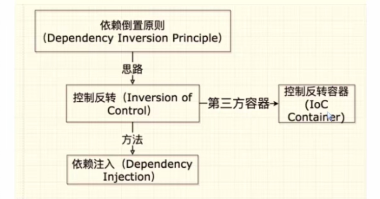
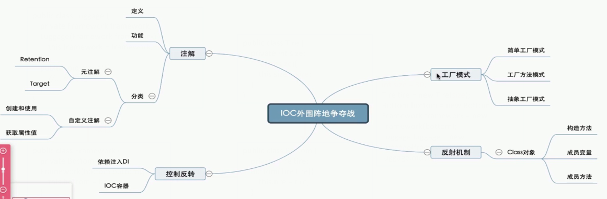

# my-spring-framework
## 项目概览

本项目通过对Spring源码的学习与理解，完成了Spring框架的IOC、AOP和MVC功能模块的开发、Bean的生命周期等功能的开发。通过从 0 搭建一个较为完备的 Web 框架来提升框架设计能力，了解 Spring 框架的设计思路。

项目分为下面两条主线，一条是自研 Spring 框架，源码放在`src/main/java/org/simpleframework`这个包下面（其中 java 包下面的 com 是一个 Web 项目的 Demo，主要用于测试自研框架的功能，而 demo 是实现自研源码过程中涉及的泛型、设计模式、反射、注解的 demo ），另外一条主线是剖析 Spring 框架源码，源码需要自己去 Spring 官网 clone 到本地进行编译。


## 环境准备

### 模块梳理

**Spring设计的初衷**

用于构造Java应用程序的轻量级框架；
1、可以采用Spring来构造任何程序，而不局限于Web程序；

2、轻量级：最少的侵入，与应用程序低耦合，接入成本低；

3、最直观的感受：基于 POJO，构建出稳健而强大的应用；

**Spring的野心**

为各大技术领域提供支持；
微服务、移动开发、社交API集成、安全管理、云计算等等；

**Spring框架图**


**Spring基础核心模块预览**

1. spring-core

   包含框架基本的核心工具类，其他组件都要使用到这个包里的类；定义并提供资源的访问方式；

2. spring-beans

   Spring主要面向Bean编程（BOP）；

   Bean的定义、解析、创建；

   BeanFactory；

3. spring-context

   为Spring提供运行时环境，保存对象的状态；

   扩展了BeanFactory；

   ApplicationContext；

4. spring-aop

   最小化的动态代理实现；

   JDK动态代理；

   Cglib；

   只能使用运行时织入，仅支持方法级编织，仅支持方法执行切入点；

**为了完整而讲的非核心模块**

在Java语言中，从织入切面的方式来看，存在三种织入方式：


### Spring源码的下载和编译

1. 从 github 上拉下 5.2.0.RELEASE 的 Spring 源码，然后在 build.gradle 文件中的 buildscript 加入 repositories 代码块，以后 gradle 本身的依赖就走这个阿里云镜像去下载

```
buildscript {
    repositories {
    	maven { url'https://maven.aliyun.com/repository/public/' }
    	maven { url'https://maven.aliyun.com/repository/jcenter/' }
    }
	dependencies {
		classpath 'org.asciidoctor:asciidoctorj-pdf:1.5.0-alpha.16'
		classpath 'io.spring.asciidoctor:spring-asciidoctor-extensions:0.1.3.RELEASE'
	}
}
```

2. 项目的依赖就走这个地址去下载

```
repositories {
    maven { url'https://maven.aliyun.com/repository/public/' }
    maven { url'https://maven.aliyun.com/repository/jcenter/' }
    mavenCentral()
    maven { url "https://repo.spring.io/libs-spring-framework-build" }
}
```

3. 根据 github 上文档要求在 git 命令行执行下面指令

```bash
./gradlew :spring-oxm:compileTestJava
```

结果如下：


4. 将源码项目导入 idea 然后等待 相关 jar 包下载
5. 由于 spring-aspects 编译和其余包编译方法不同，故需要将 spring-aspects 从项目移除

### Demo

1. 新建一个 gradle 模块，然后引入 spring 其他模块作为依赖
由于 spring-context 模块自身也引入了 core、aop、beans 等模块，所以在这里不必引入它们了
```
dependencies {
    compile(project(":spring-context"))
    testCompile group: 'junit', name: 'junit', version: '4.12'
}
```

2. 实现 WelcomeService 及其实现类

```java
/*WelcomeService.java*/
public interface WelcomeService {
	String sayHello(String name);
}
/*WelcomeServiceImpl.java*/
public class WelcomeServiceImpl implements WelcomeService {

	@Override
	public String sayHello(String name) {
		System.out.println("欢迎您："+ name);
		return "success";
	}
}
```

3. 通过 xml 文件将 WelcomeService 及其实现类注入 Ioc 容器

```xml
<?xml version="1.0" encoding="UTF-8"?>
<beans xmlns="http://www.springframework.org/schema/beans"
	   xmlns:xsi="http://www.w3.org/2001/XMLSchema-instance"
	   xsi:schemaLocation="http://www.springframework.org/schema/beans
	   				       https://www.springframework.org/schema/beans/spring-beans.xsd">

	<bean id="welcomeService" class="com.noah2021.service.impl.WelcomeServiceImpl"/>
</beans>
```

5. 实现测试类，调用容器中的 bean 检测是否注入成功，如果成功，同时也佐证了 Spring 源码编译成功

```java
public class Entrance {
	public static void main(String[] args) {
		System.out.println("Hello world!");
		String xmlPath = "E:\\Git\\Gitee-Repository\\spring-framework-5.2.0.RELEASE\\springdemo\\src\\main\\resources\\spring\\spring-config.xml";
		ApplicationContext applicationContext = new FileSystemXmlApplicationContext(xmlPath);
		WelcomeService welcomeService = applicationContext.getBean("welcomeService", WelcomeService.class);
		welcomeService.sayHello("Noah2021");
	}
}
```

### 搭建自研框架雏形
1. 依靠骨架新建一个 web 项目
2. 在 pom 文件内导入 jsp 和 servlet 的依赖
```xml
<dependencies>
    <dependency>
        <groupId>javax.servlet</groupId>
        <artifactId>javax.servlet-api</artifactId>
        <version>4.0.1</version>
        <scope>provided</scope>
    </dependency>
    <dependency>
        <groupId>javax.servlet.jsp</groupId>
        <artifactId>javax.servlet.jsp-api</artifactId>
        <version>2.3.3</version>
        <scope>provided</scope>
    </dependency>
</dependencies>
```
3. 编写 jsp 文件
```jsp
<%@ page pageEncoding="UTF-8" isELIgnored="false" %>
<html>
    <head>
        <title>Hello</title>
    </head>
    <body>
        <h1>Hello</h1>
        <h2>厉害了，${name}</h2>
    </body>
</html>
```
4. 编写对应的 web 后端代码
```java
@WebServlet("/hello")
public class HelloServlet extends HttpServlet {

    @Override
    protected void doGet(HttpServletRequest req, HttpServletResponse resp) throws ServletException, IOException {
        String name = "我的简易框架";
        req.setAttribute("name", name);
        req.getRequestDispatcher("/WEB-INF/jsp/hello.jsp").forward(req,resp);
    }
}
```
5. 配置 tomcat 并启动
6. 理解 jsp 运行原理


## 业务系统架子的搭建

1. 创建 o2odb 数据库
2. **门面/外观模式(Facade)**：提供了一个统一的接口，用来访问子系统中的一群接口，从而让子系统更容易使用。下面举个门面模式的例子，其中 slf4j-log4j12 (Simple Logging Facade for Java)就是依靠门面模式解决了各个版本 jar 包依赖冲突问题。

```java
public class SubSystem {
    public void turnOnTV() {
        System.out.println("turnOnTV()");
    }

    public void setCD(String cd) {
        System.out.println("setCD( " + cd + " )");
    }

    public void startWatching(){
        System.out.println("startWatching()");
    }
}
public class Facade {
    private SubSystem subSystem = new SubSystem();

    public void watchMovie() {
        subSystem.turnOnTV();
        subSystem.setCD("a movie");
        subSystem.startWatching();
    }
}
public class Client {
    public static void main(String[] args) {
        Facade facade = new Facade();
        facade.watchMovie();
    }
}
```

3. 导入 slf4j-log4j12 和 lombok 的依赖，引入 log4j.properties 配置文件并测试（包括注解和工厂创建两者方式）
4. 实现 basicobject 相关类（HeadLine 和 ShopCategory）
5. 掌握泛型类、泛型接口、泛型方法的使用

   - 泛型类、泛型方法
```java
/*GenericClassExample.java*/
@Data
public class GenericClassExample<T> {
    private T member;

    public GenericClassExample(T member) {
        this.member = member;
    }

    public T headSomething(T target) {
        return target;
    }

    public String sayHello(String name) {
        return "hello, " + name;
    }

    public static <T> void printArray(T[] inputArray) {
        for (T element : inputArray) {
            System.out.printf("%s", element);
            System.out.print(" ");
        }
        System.out.println();
    }
}
/*GeneraicDemo.java*/
public class GeneraicDemo {
    public static void handMember(GenericClassExample<? super Integer> genericClassExample){
        Integer integer = 123 + (Integer) genericClassExample.getMember();
        System.out.println("result is " + integer);
    }

    public static void main(String[] args) {
        GenericClassExample<Number> integerExample = new GenericClassExample<Number>(123);
        GenericClassExample<String> stringExample = new GenericClassExample<>("abc");
        System.out.println(integerExample.getClass());
        System.out.println(stringExample.getClass());
        handMember(integerExample);
        Integer[] integers = {1, 2, 3, 4, 5, 6};
        Double[] doubles = {1.1, 1.2, 1.3, 1.4, 1.5};
        Character[] characters = {'A', 'B', 'C'};
        stringExample.printArray(integers);
        stringExample.printArray(doubles);
        stringExample.printArray(characters);
    }
    /*  class demo.generic.GenericClassExample   //说明泛型只存在与编译期，详情请移步“泛型擦除”
        class demo.generic.GenericClassExample   //目的是避免过多的创建类而造成的运行时的过度消耗
        result is 246
        1 2 3 4 5 6
        1.1 1.2 1.3 1.4 1.5
        A B C
    * */
}
```

   - 泛型接口
```java
/*GenericFactory.java*/
public interface GenericFactory<T,N> {
    T nextObject();
    N nextNumber();
}
/*GenericFactory.java*/
public class RobotFactory implements GenericFactory<String, Integer>{
    private String[] stringRobot = new String[]{"Hello","Hi"};
    private Integer[] integerRobot = new Integer[]{111,000};
    @Override
    public String nextObject() {
        Random random = new Random();
        return stringRobot[random.nextInt(2)];//[0,2)
    }

    @Override
    public Integer nextNumber() {
        Random random = new Random();
        return integerRobot[random.nextInt(2)];
    }

    public static void main(String[] args) {
        GenericFactory<String, Integer> factory = new RobotFactory();
        System.out.println(factory.nextObject());
        System.out.println(factory.nextNumber());
    }
}
```

1. 实现 datatransferobject 相关类（MainPageInfoDTO 和 Result）
2. Service 层代码架子的搭建
    - solo 相关类
    - combine 相关类：包含多个 solo 相关类，统一对 controller 提供服务
3. Controller 层代码架子的搭建
## 自研框架IOC实现前奏
### 工厂模式

工厂模式将创建对象的**具体过程屏蔽隔离**起来，从而达到更高的灵活性，工厂模式可以分为三类：

**简单工厂**

简单工厂模式包含以下几个主要组成部分：

1. 产品接口（Product Interface）：定义了工厂所创建的对象的共同接口。该接口可以是一个抽象类或者接口，定义了产品对象的行为。
2. 具体产品（Concrete Product）：实现了产品接口的具体对象，是工厂所创建的对象的具体类型。
3. 简单工厂（Simple Factory）：负责创建产品对象的工厂类。它根据客户端的请求，决定实例化哪个具体产品对象，并将其返回给客户端。

简单工厂模式的工作流程如下：

1. 客户端通过调用工厂类的方法来请求一个产品对象。
2. 工厂类根据客户端的请求，决定实例化哪个具体产品对象。
3. 工厂类实例化具体产品对象，并将其返回给客户端。
4. 客户端通过产品接口操作具体产品对象。

**工厂方法**

工厂方法模式将工厂抽象化，并定义一个创建对象的接口。每增加新产品，只需增加该产品以及对应的具体实现工厂类，由具体工厂类决定要实例化的产品是哪个，将对象的创建与实例化延迟到子类，这样工厂的设计就符合“开闭原则”了，扩展时不必去修改原来的代码。

工厂方法模式包含以下几个主要组成部分：

1. 抽象产品（Abstract Product）：具体产品继承的父类或实现的接口，在 Java 中一般由抽象类或者接口来实现。
2. 具体产品（Concrete Product）：实现了产品接口的具体对象，是工厂所创建的对象的具体类型。
3. 具体工厂（Factory）：被应用程序调用以创建具体产品的对象，含有和具体业务逻辑有关的代码。
4. 抽象工厂（AbstractFactory）：工厂方法模式的核心，是具体工厂角色必须实现的接口或者必须继承的父类，在 Java 中它由抽象类或者接口来实现。

**抽象工厂**

抽象工厂模式主要**用于创建相关对象的家族**。当一个产品族中需要被设计在一起工作时，通过抽象工厂模式，能够保证客户端始终只使用同一个产品族中的对象。

抽象工厂模式包含以下几个主要组成部分：

1. 抽象产品（Abstract Product）：具体产品继承的父类或实现的接口，在 Java 中一般由抽象类或者接口来实现。
2. 具体产品（Concrete Product）：实现了产品接口的具体对象，是工厂所创建的对象的具体类型。
3. 具体工厂（Factory）：用于生产不同产品族，要创建一个产品，用户只需使用其中一个工厂进行获取，完全不需要实例化任何产品对象。
4. 抽象工厂（AbstractFactory）：定义了一个接口，这个接口包含了一组方法用来生产产品，所有的具体工厂都必须实现此接口。

### 反射

1. Class类的特点
   - Class 类也是类的一种，class 则是关键字
   - Class 类只有一个私有的构造函数，只有 JVM 能够创建 Class 类的实例
   - JVM 中只有唯一一个和类相对应的 Class 对象来描述其类型信息
2. 获取Class对象的方式

```java
public static void main(String[] args) throws ClassNotFoundException {
    //第一种方式获取class对象
    ReflectTarget reflectTarget = new ReflectTarget();
    Class reflectTargetClass1 = reflectTarget.getClass();
    System.out.println("1==>"+reflectTargetClass1.getName());
    //第二种方式获取class对象
    Class reflectTargetClass2 = ReflectTarget.class;
    System.out.println("2==>"+reflectTargetClass2.getName());
    //第三种方式获取class对象
    Class reflectTargetClass3 = Class.forName("demo.reflect.ReflectTarget");
    System.out.println("3==>"+reflectTargetClass3.getName());
}
/*在运行期，一个类只有一个与之对应的Class对象产生
    1==>demo.reflect.ReflectTarget
    2==>demo.reflect.ReflectTarget
    3==>demo.reflect.ReflectTarget
* */
```

3. 获取构造方法并调用：通过Class对象可以获取某个类中的构造方法

   - 批量的方法

   ​		public Constructor[] getConstructors()：所有"公有的"构造方法
   ​		public Constructor[] getDeclaredConstructors()：获取所有的构造方法(包括私有、受保护、默认、公有)

   - 获取单个的方法，并调用

   ​		public Constructor getConstructor(Class... parameterTypes):获取单个的"公有的"构造方法：

   ​		public Constructor getDeclaredConstructor(Class... parameterTypes):获取"某个构造方法"可以是私有的，或受保护、默认、		公有；

   - 调用构造方法(如果构造方法是 private 修饰需要先暴力反射)：Constructor-->newInstance(Object... initargs)

4. 获取成员变量并调用

   - 批量的

      Field[] getFields():获取所有的"公有字段"

      Field[] getDeclaredFields():获取所有字段，包括：私有、受保护、默认、公有；

   - 获取单个的

      public Field getField(String fieldName):获取某个"公有的"字段；

      public Field getDeclaredField(String fieldName):获取某个字段(可以是私有的)

   - 设置字段的值(如果成员变量是 private 修饰需要先暴力反射)

      Field --> public void set(Object obj,Object value):

   - 参数说明

      obj:要设置的字段所在的对象（非Class对象，是由构造方法生成的）

      value:要为字段设置的值

5. 获取成员方法并调用

   - 批量的

      public Method[] getMethods():获取所有"公有方法"（包含了父类的方法也包含Object类）

      public Method[] getDeclaredMethods():获取所有的成员方法，包括私有的(不包括继承的)

   - 获取单个的

   ​		public Method getMethod(String name,Class<?>... parameterTypes):

   ​		public Method getDeclaredMethod(String name,Class<?>... parameterTypes)

   - 参数：

      name : 方法名

      Class ... : 形参的Class类型对象

   - 调用方法(如果成员方法是 private 修饰需要先暴力反射)

      Method --> public Object invoke(Object obj,Object... args):

   - 参数说明

      obj : 要调用方法的对象（非Class对象，是由构造方法生成的）

      args:调用方式时所传递的实参

### 注解
1. 注解的功能
   - 作为特定的标记，用于告诉编译器一些信息
   - 编译时动态处理，如动态生成代码
   - 运行时动态处理，作为额外信息的媒体，如获取注解信息
2. 注解的分类
   - 标准注解：@Override、@Deprecated、@SupressWarnings
   - 元注解(修饰注解的注解，通常用在注解的定义之上)：@Retention、@Target、@Inherited、@Documented
    @Target：定义注解的作用目标
    @Retention：定义注解的生命周期，用于决定被该元注解修饰的注解是否显示在编译的文件中
    @Inherited：是否允许子类继承该注解
    @Documented：注解是否应当被包含在 JavaDoc 文档中
   - 自定义注解(使用元注解实现)

3. 自定义注解
   - 自定义注解格式
```java
public @interface 注解名{
    修饰符 返回值 属性名() 默认值;
    修饰符 返回值 属性名() 默认值;
    ...
}
```
   - 注解属性支持的类型
     
        - 所有的基本数据类型
        - Enum类型
        
           - String类型
           - Annotation类型
           - Class 类型
           - 以上所有类型的数组
4. 注解实现

```java
/*CourseInfoAnnotation.java*/
@Target({ElementType.TYPE,ElementType.METHOD})
@Retention(RetentionPolicy.RUNTIME)
public @interface CourseInfoAnnotation {
    //课程名称
    public String courseName();
    //课程标签
    public  String courseTag();
    //课程简介
    public String courseProfile();
    //课程序号
    public int courseIndex() default 303;
}
/*PersonInfoAnnotation.java*/
@Target(ElementType.FIELD)
@Retention(RetentionPolicy.RUNTIME)
public @interface PersonInfoAnnotation {
    //名字
    public String name();
    //年龄
    public int age() default 20;
    //性别
    public String gender() default "男";
    //开发语言
    public String[] language();
}
/*Noah2021Course.java*/
@CourseInfoAnnotation(courseName = "数学",courseTag = "高中",courseProfile = "又难又多")
public class Noah2021Course {
    @PersonInfoAnnotation(name = "Noah2021",language = {"Java","c++","python"})
    private String author;
    @CourseInfoAnnotation(courseName = "化学",courseTag = "理综",courseProfile = "非常难")
    public void getCourseInfo(){
    }
}
/*AnnotationParser.java*/
public class AnnotationParser {
    //解析类的注解
    public static void parseTypeAnnotation() throws ClassNotFoundException {
        Class clazz = Class.forName("demo.annotation.Noah2021Course");
        //这里获取的是class对象的注解，而不是其里面的方法和成员变量的注解
        Annotation[] annotations = clazz.getAnnotations();
        for (Annotation annotation : annotations) {
            CourseInfoAnnotation courseInfoAnnotation = (CourseInfoAnnotation) annotation;
            System.out.println("课程名:" + courseInfoAnnotation.courseName() + "\n" +
                    "课程标签：" + courseInfoAnnotation.courseTag() + "\n" +
                    "课程简介：" + courseInfoAnnotation.courseProfile() + "\n" +
                    "课程序号：" + courseInfoAnnotation.courseIndex()+"\n");
        }
    }

    //解析成员变量上的标签
    public static void parseFieldAnnotation() throws ClassNotFoundException {
        Class clazz = Class.forName("demo.annotation.Noah2021Course");
        Field[] fields = clazz.getDeclaredFields();
        for (Field f : fields) {
            //判断当前成员变量中是否有指定注解类型的注解
            boolean hasAnnotation = f.isAnnotationPresent(PersonInfoAnnotation.class);
            if (hasAnnotation) {
                PersonInfoAnnotation personInfoAnnotation = f.getAnnotation(PersonInfoAnnotation.class);
                System.out.println("名字：" + personInfoAnnotation.name() + "\n" +
                        "年龄：" + personInfoAnnotation.age() + "\n" +
                        "性别：" + personInfoAnnotation.gender());
                for (String language : personInfoAnnotation.language()) {
                    System.out.println("开发语言：" + language);
                }

            }
        }
    }

    //解析方法注解
    public static void parseMethodAnnotation() throws ClassNotFoundException {
        Class clazz = Class.forName("demo.annotation.Noah2021Course");
        Method[] methods = clazz.getDeclaredMethods();
        for (Method method : methods) {
            //判断当前成员方法中是否有指定注解类型的注解
            boolean hasAnnotation = method.isAnnotationPresent(CourseInfoAnnotation.class);
            if (hasAnnotation) {
                CourseInfoAnnotation courseInfoAnnotation = method.getAnnotation(CourseInfoAnnotation.class);
                System.out.println("\n" + "课程名：" + courseInfoAnnotation.courseName() + "\n" +
                        "课程标签：" + courseInfoAnnotation.courseTag() + "\n" +
                        "课程简介：" + courseInfoAnnotation.courseProfile() + "\n" +
                        "课程序号：" + courseInfoAnnotation.courseIndex() + "\n");
            }
        }
    }

    public static void main(String[] args) throws ClassNotFoundException {
        parseTypeAnnotation();
        parseFieldAnnotation();
        parseMethodAnnotation();
    }
}
```

5. **注解的工作原理**
   - 通过键值对的形式为注解属性赋值
   - 编译器检查注解的使用范围，将注解信息写入元素属性表
   - 运行时 JVM 将 RUNTIME 的所有注解属性取出并最终存入 map 里（单个Class文件内所有的RUNTIME的注解而非整个项目的RUNTIME注解）
   - 创建AnnotationInvacationHandler实例并传入前面的map
   - JVM使用JDK动态代理为注解生成动态代理类，并初始化处理器
   - 调用invoke方法，通过传入方法名返回注解对应的属性值

### 上述学习对自研框架的意义

1. 控制反转 IoC (Inversion of Controller)
   - 依托一个类似工厂的 IoC 容器
   - 将对象的创建、依赖关系的管理以及生命周期交由IoC容器管理
   - 降低系统在实现上的复杂性和耦合度,易于扩展,满足开闭原则（软件中的对象（类、模块、方法等），对于扩展是开放的，对于修改是封闭的）

2. IoC容器的优势
   - 避免在各处使用new来创建类 ,并且可以做到统一维护
   - 创建实例的时候不需要 了解其中的细节
   - 反射+工厂模式的合体,满足开闭原则

3. 依赖注入 
   - 构造方法实现注入 
   - setter实现注入 
   - 接口实现注入
   - 注解实现注入

4. 依赖倒置原则、IoC、DI、IoC容器的关系



5. 控制反转的例子

   一个行李箱是由轮子-->底盘-->箱体-->行李箱构成，但是当轮子发生改变大小时，上层的结构都需要改变，这无疑是不可接受的


​		依靠控制反转就可以很好地解决这个问题


### 导图总结



## 自研框架IoC容器的实现

### 框架具备的基本功能

- 解析配置（XML、注解等）
- 定义和注册对象
- 注入对象
- 提供通用的工具类

### IoC容器的实现

创建注解-->提取标记对象-->实现容器-->依赖注入
#### 创建注解
```java
@Target(ElementType.TYPE)
@Retention(RetentionPolicy.RUNTIME)
public @interface Component {
}
@Target(ElementType.TYPE)
@Retention(RetentionPolicy.RUNTIME)
public @interface Controller {
}
@Target(ElementType.TYPE)
@Retention(RetentionPolicy.RUNTIME)
public @interface Service {
}
@Target(ElementType.TYPE)
@Retention(RetentionPolicy.RUNTIME)
public @interface Resipotory {
}
```
#### 提取标记对象
- 指定范围，获取范围内的所有类
- 遍历所有类，获取被注解标记的类并加载进容器中
- 测试

```java
/**
 * 〈通过类加载器可以获得多种资源，我们就是要获取 file 类型的class集合〉
 *
 * @author Noah2021
 * @create 2021/3/7
 * @return
 */
public class ClassUtil {
    public static final String FILE_PROTOCOL = "file";
    /**
     * 获取包下类集合
     *
     * @param packageName 包名
     * @return 类集合
     */
    public static Set<Class<?>> extractPackageClass(String packageName){
        //1.获取到类的加载器。
        ClassLoader classLoader = getClassLoader();
        //2.通过类加载器获取到加载的资源
        URL url = classLoader.getResource(packageName.replace(".", "/"));
        if (url == null){
            //log.warn("unable to retrieve anything from package: " + packageName);
            System.out.println("【WARN】unable to retrieve anything from package: " + packageName);
            return  null;
        }
        //3.依据不同的资源类型，采用不同的方式获取资源的集合
        Set<Class<?>> classSet = null;
        //过滤出文件类型的资源
        if (url.getProtocol().equalsIgnoreCase(FILE_PROTOCOL)){
            classSet = new HashSet<Class<?>>();
            File packageDirectory = new File(url.getPath());
            extractClassFile(classSet, packageDirectory, packageName);
        }
        //TODO 此处可以加入针对其他类型资源的处理

        return classSet;
    }
    /**
     * 递归获取目标package里面的所有class文件(包括子package里的class文件)
     *
     * @param emptyClassSet 装载目标类的集合
     * @param fileSource    目录
     * @param packageName   包名
     * @return 类集合
     */
    private static void extractClassFile(Set<Class<?>> emptyClassSet, File fileSource, String packageName) {
        if(!fileSource.isDirectory()){
            return;
        }
        //如果是一个目录，则调用其listFiles方法获取文件夹下的文件或文件夹
        File[] files = fileSource.listFiles(new FileFilter() {
            @Override
            public boolean accept(File file) {
                if(file.isDirectory()){
                    return true;
                } else{
                    //获取文件的绝对值路径
                    String absoluteFilePath = file.getAbsolutePath();
                    if(absoluteFilePath.endsWith(".class")){
                        //若是class文件，则直接加载
                        addToClassSet(absoluteFilePath);
                    }
                }
                return false;
            }
            //根据class文件的绝对值路径，获取并生成class对象，并放入classSet中
            private void addToClassSet(String absoluteFilePath) {
                //1.从class文件的绝对值路径里提取出包含了package的类名
                //如/Users/baidu/imooc/springframework/sampleframework/target/classes/com/imooc/entity/dto/MainPageInfoDTO.class
                //需要弄成com.imooc.entity.dto.MainPageInfoDTO
                absoluteFilePath = absoluteFilePath.replace(File.separator, ".");
                String className = absoluteFilePath.substring(absoluteFilePath.indexOf(packageName));
                //去掉.class后缀
                className = className.substring(0, className.lastIndexOf("."));
                //2.通过反射机制获取对应的Class对象并加入到classSet里
                Class targetClass = loadClass(className);
                emptyClassSet.add(targetClass);
            }
        });
        if(files != null){
            for(File f : files){
                //递归调用
                extractClassFile(emptyClassSet, f, packageName);
            }
        }
    }
    /**
     * 获取Class对象
     *
     * @param className class全名=package + 类名
     * @return Class
     */
    public static Class<?> loadClass(String className){
        try {
            return Class.forName(className);
        } catch (ClassNotFoundException e) {
            //log.error("load class error:", e);
            System.out.println("load class error:"+ e);
            throw new RuntimeException(e);
        }
    }
    /**
     * 获取classLoader
     *
     * @return 当前ClassLoader
     */
    public static  ClassLoader getClassLoader(){
        return Thread.currentThread().getContextClassLoader();
    }
    //测试
    public class ClassUtilTest {
        @DisplayName("提取目标类方法:extractPackageClassTest")
        @Test
        public void extractPackageClassTest(){
            Set<Class<?>> classSet = ClassUtil.extractPackageClass("com.noah2021.entity");
            for (Class clazz:classSet) {
                System.out.println(clazz);
            }
            Assertions.assertEquals(4, classSet.size());
        }
    }
}
/*控制台打印结果*/
class com.noah2021.entity.dto.MainPageInfoDTO
class com.noah2021.entity.bo.HeadLine
class com.noah2021.entity.bo.ShopCategory
class com.noah2021.entity.dto.Result
```
#### 实现容器

- 初始化

```java
/*BeanContainer.java*/
@NoArgsConstructor(access = AccessLevel.PRIVATE)
public class BeanContainer {
	private enum ContainerHolder {
        HOLDER;
        private BeanContainer instance;

        ContainerHolder() {
            instance = new BeanContainer();
        }
    }
    //获取bean容器实例
    public static BeanContainer getInstance() {
        return ContainerHolder.HOLDER.instance;
    }
}
```

- 保存Class对象及其实例的载体

```java
/*BeanContainer.java*/
//用于存放所有被配资标记的目标对象的Map
private final Map<Class<?>, Object> beanMap = new ConcurrentHashMap();
```

- 保存Class对象及其实例的载体

   1. 注解配置的管理与获取  

   2. 获取指定范围内的Class对象(上面已完成)  

   3. 依据配置提取Class对象，连同实例一并存入容器

   4. 测试

```java
/*BeanContainer.java*/
//加载bean的注解列表
private static final List<Class<? extends Annotation>> BEAN_ANNOTATION
            = Arrays.asList(Component.class, Controller.class, Service.class, Repository.class, Aspect.class);   

//是否加载过bean
private boolean loaded = false;
public boolean isLoaded() {
    return loaded;
}
//bean实例数量
public int size() {
    return beanMap.size();
}
//扫描加载所有的bean
public synchronized void loadBeans(String packageName) {
    //判断bean容器是否被加载过
    if(isLoaded()){
        System.out.println("【WARN】BeanContainer has been loaded");
        return;
    }
    Set<Class<?>> classSet = ClassUtil.extractPackageClass(packageName);
    //新建一个验证工具类ValidationUtil用于字符串、数组等的判空校验
    if(ValidationUtil.isEmpty(classSet)){
        System.out.println("【WARN】extract nothing from packageName" + packageName);
        return;
    }
    for (Class clazz:classSet) {
        for (Class<? extends Annotation> annotation: BEAN_ANNOTATION) {
            //如果类上面标记了定义的注解
            if(clazz.isAnnotationPresent(annotation))
                //将目标类本身作为键，目标类的实例作为值，放入到beanMap中,定义一个newInstance方法用于通过反射初始化对象
                beanMap.put(clazz, ClassUtil.newInstance(clazz,true));
        }
    }
    loaded = true;
}
//在com.noah2021包里面加上一些自定义注解，然后进行测试
public class BeanContainerTest {
    private static BeanContainer beanContainer;
    @BeforeAll
    static void init(){
        beanContainer = BeanContainer.getInstance();
    }
    @DisplayName("加载目标类及其实例到BeanContainer：loadBeansTest")
    @Test
    public void loadBeansTest(){
        Assertions.assertEquals(false, beanContainer.isLoaded());
        beanContainer.loadBeans("com.noah2021");
        Assertions.assertEquals(6, beanContainer.size());
        Assertions.assertEquals(true, beanContainer.isLoaded());
    }
}
```

- 容器的操作方式，涉及到容器的增删改查
    1. 增加、删除操作
    2. 通过Class获取对应实例
    3. 获取所有的Class和实例
    4. 通过注解来获取被注解标注的Class
    5. 通过超类获取对应的子类Class
    6. 获取容器载体保存Class的数量
    7. 在com.noah2021包里添加自定义注解，并进行单元测试

    ```java
    /*BeanContainer.java*/ 
    /**
     * 添加一个class对象及其Bean实例
     * @param clazz Class对象
     * @param bean  Bean实例
     * @return 原有的Bean实例, 没有则返回null
     */
    public Object addBean(Class<?> clazz, Object bean) {
        return beanMap.put(clazz, bean);
    }
    /*移除一个IOC容器管理的对象*/
    public Object removeBean(Class<?> clazz) {
        return beanMap.remove(clazz);
    }
    /*根据Class对象获取Bean实例*/
    public Object getBean(Class<?> clazz) {
        return beanMap.get(clazz);
    }
    /*获取容器管理的所有Class对象集合*/
    public Set<Class<?>> getClasses(){
        return beanMap.keySet();
    }
    /*获取所有Bean集合*/
    public Set<Object> getBeans(){
        return new HashSet<>(beanMap.values());
    }
    /*根据注解筛选出Bean的Class集合*/
    public Set<Class<?>> getClassesByAnnotation(Class<? extends Annotation> annotation){
        //1.获取beanMap的所有class对象
        Set<Class<?>> keySet = getClasses();
        if(ValidationUtil.isEmpty(keySet)){
            //log.warn("nothing in beanMap");
            System.out.println("【WARN】nothing in beanMap");
            return null;
        }
        //2.通过注解筛选被注解标记的class对象，并添加到classSet里
        Set<Class<?>> classSet = new HashSet<>();
        for(Class<?> clazz : keySet){
            //类是否有相关的注解标记
            if(clazz.isAnnotationPresent(annotation)){
                classSet.add(clazz);
            }
        }
        return classSet.size() > 0? classSet: null;
    }
    /*通过接口或者父类获取实现类或者子类的Class集合，不包括其本身*/
    public Set<Class<?>> getClassesBySuper(Class<?> interfaceOrClass){
        //1.获取beanMap的所有class对象
        Set<Class<?>> keySet = getClasses();
        if(ValidationUtil.isEmpty(keySet)){
            //log.warn("nothing in beanMap");
            System.out.println("【WARN】nothing in beanMap");
            return null;
        }
        //2.判断keySet里的元素是否是传入的接口或者类的子类，如果是，就将其添加到classSet里
        Set<Class<?>> classSet = new HashSet<>();
        for(Class<?> clazz : keySet){
            //判断keySet里的元素是否是传入的接口或者类的子类（非实现类对象或子类对象）
            //父类.class.isAssignableFrom(子类.class)
            if(interfaceOrClass.isAssignableFrom(clazz) && !clazz.equals(interfaceOrClass)){
                classSet.add(clazz);
            }
        }
        return classSet.size() > 0? classSet: null;
    }
    
    /*BeanContainerTest.java*/
    @TestMethodOrder(MethodOrderer.OrderAnnotation.class)
    public class BeanContainerTest {
        private static BeanContainer beanContainer;
        @BeforeAll
        static void init(){
            beanContainer = BeanContainer.getInstance();
        }
        @DisplayName("加载目标类及其实例到BeanContainer：loadBeansTest")
        @Order(1)
        @Test
        public void loadBeansTest(){
            Assertions.assertEquals(false, beanContainer.isLoaded());
            beanContainer.loadBeans("com.noah2021");
            Assertions.assertEquals(6, beanContainer.size());
            Assertions.assertEquals(true, beanContainer.isLoaded());
        }
        @DisplayName("根据类获取其实例：getBeanTest")
        @Order(2)
        @Test
        public void getBeanTest(){
            MainPageController controller = (MainPageController)beanContainer.getBean(MainPageController.class);
            Assertions.assertEquals(true, controller instanceof MainPageController);
            DispatcherServlet dispatcherServlet = (DispatcherServlet) beanContainer.getBean(DispatcherServlet.class);
            Assertions.assertEquals(null, dispatcherServlet);
        }
        @DisplayName("根据注解获取对应的实例：getClassesByAnnotationTest")
        @Order(3)
        @Test
        public void getClassesByAnnotationTest(){
            Assertions.assertEquals(true, beanContainer.isLoaded());
            Assertions.assertEquals(3, beanContainer.getClassesByAnnotation(Controller.class).size());
        }
        @DisplayName("根据接口获取实现类：getClassesBySuperTest")
        @Order(4)
        @Test
        public void getClassesBySuperTest(){
            Assertions.assertEquals(true, beanContainer.isLoaded());
            Assertions.assertEquals(true, beanContainer.getClassesBySuper(HeadLineService.class).contains(HeadLineServiceImpl.class));
        }
    }
    ```
#### 依赖注入
**存在问题**
实例里面某些必须的成员变量还没有被创建出来,比如：虽然被@Controller注解的MainPageController实例获取到了，但它下面的headLineShopCategoryCombineService为null
**实现思路**

   - 定义相关的注解标签

   - 实现创建被注解标记的成员变量的实例，并将其注入到成员变量里

        - 遍历 Bean 容器中所有的 Class 对象
        - 遍历 Class 对象的所有成员变量
        - 找出被 Autowired 标记的成员变量
        - 获取这些成员变量的类型
        - 获取这些成员变量的类型在容器里对应的实例
        - 通过反射将对应的成员变量实例注入到成员变量所在类的实例里
```java
/*Autowired.java*/
//Autowired目前只支持成员变量的注入
@Target(ElementType.FIELD)
@Retention(RetentionPolicy.RUNTIME)
public @interface Autowired {
    String value() default "";
}
/*DependencyInjector.java*/
public class DependencyInjector {
    //Bean容器
    private BeanContainer beanContainer;
    public DependencyInjector(){
        beanContainer = BeanContainer.getInstance();
    }
    /**
     * 执行Ioc
     */
    public void doIoc(){
        if(ValidationUtil.isEmpty(beanContainer.getClasses())){
            //log.warn("empty classset in BeanContainer");
            System.out.println("【WARN】empty classSet in BeanContainer");
            return;
        }
        //1.遍历Bean容器中所有的Class对象
        for(Class<?> clazz : beanContainer.getClasses()){
            //2.遍历Class对象的所有成员变量
            Field[] fields = clazz.getDeclaredFields();
            if (ValidationUtil.isEmpty(fields)){
                continue;
            }
            for(Field field : fields){
                //3.找出被Autowired标记的成员变量
                if(field.isAnnotationPresent(Autowired.class)){
                    Autowired autowired = field.getAnnotation(Autowired.class);
                    String autowiredValue = autowired.value();
                    //4.获取这些成员变量的类型
                    Class<?> fieldClass = field.getType();
                    //5.获取这些成员变量的类型在容器里对应的实例
                    Object fieldValue = getFieldInstance(fieldClass, autowiredValue);
                    if(fieldValue == null){
                        throw new RuntimeException("unable to inject relevant type，target fieldClass is:" + fieldClass.getName() + " autowiredValue is : " + autowiredValue);
                    } else {
                        //6.通过反射将对应的成员变量实例注入到成员变量所在类的实例里
                        Object targetBean =  beanContainer.getBean(clazz);
                        ClassUtil.setField(field, targetBean, fieldValue, true);
                    }
                }
            }
        }
    }
    /**
     * 根据Class在beanContainer里获取其实例或者实现类
     */
    private Object getFieldInstance(Class<?> fieldClass, String autowiredValue) {
        Object fieldValue = beanContainer.getBean(fieldClass);
        if (fieldValue != null){
            return fieldValue;
        } else { //说明这个成员变量是一个接口，需要得到它的实现类实例注入到bean容器
            Class<?> implementedClass = getImplementedClass(fieldClass, autowiredValue);
            if(implementedClass != null){
                return beanContainer.getBean(implementedClass);
            } else {
                return null;
            }
        }
    }
    /**
     * 获取接口的实现类
     */
    private Class<?> getImplementedClass(Class<?> fieldClass, String autowiredValue) {
        Set<Class<?>> classSet =  beanContainer.getClassesBySuper(fieldClass);
        if(!ValidationUtil.isEmpty(classSet)){
            if(ValidationUtil.isEmpty(autowiredValue)){
                if(classSet.size() == 1){
                    return classSet.iterator().next();
                } else {
                    //如果多于两个实现类且用户未指定其中一个实现类，则抛出异常
                    throw new RuntimeException("multiple implemented classes for " + fieldClass.getName() + " please set @Autowired's value to pick one");
                }
            } else {
                for(Class<?> clazz : classSet){
                    if(autowiredValue.equals(clazz.getSimpleName())){
                        return clazz;
                    }
                }
            }
        }
        return null;
    }
}
```

- 依赖注入的使用(添加注解)并测试


    /*HeadLineShopCategoryCombineServiceImpl2.java*/
    @Service
    public class HeadLineShopCategoryCombineServiceImpl2 implements HeadLineShopCategoryCombineService {
        @Override
        public Result<MainPageInfoDTO> getMainPageInfo() {
            return null;
        }
    }
    /*DependencyInjectorTest.java*/
    public class DependencyInjectorTest {
        @DisplayName("依赖注入doIoc")
        @Test
        public void doIocTest(){
            BeanContainer beanContainer = BeanContainer.getInstance();
            beanContainer.loadBeans("com.noah2021");
            Assertions.assertEquals(true, beanContainer.isLoaded());
            MainPageController mainPageController = (MainPageController)beanContainer.getBean(MainPageController.class);
            Assertions.assertEquals(true, mainPageController instanceof MainPageController);
            Assertions.assertEquals(null, mainPageController.getHeadLineShopCategoryCombineService());
            new DependencyInjector().doIoc();
            Assertions.assertNotEquals(null, mainPageController.getHeadLineShopCategoryCombineService());
            Assertions.assertEquals(true, mainPageController.getHeadLineShopCategoryCombineService() instanceof HeadLineShopCategoryCombineServiceImpl1);
            Assertions.assertEquals(false, mainPageController.getHeadLineShopCategoryCombineService() instanceof HeadLineShopCategoryCombineServiceImpl2);
        }
    }

### 导图总结


## 自研框架AOP的实现

### 自上而下从左到右

容器是 OOP 的高级工具，以低耦合低侵入的方式打通从上到下的开发通道，但不擅长从左到右的系统需求会增加维护成本且破坏低耦合
系统需求：程序员才去关心的需求，比如：添加日志信息，系统权限校验
关注点分离原则：不同的问题交给不同的部分去解决，每部分专注解决自己的问题
在Spring源码里创建一个 AopDemo 需要往 springdemo 的 build.gradle 的 dependencies 模块添加 aspects 的相关依赖`compile(project(":spring-aspects"))`

### AOP的子民们

- 切面 Aspect :把通知应用到切入点的过程，将横切关注点逻辑进行模块化封装的实体对象
- 通知 Advice :好比是 Class 里面的方法，还定义了织入逻辑的时机
- 连接点 Joinpoint :类里面可以被增强的方法，允许使用 Advice 的地方
- 切入点 pointcut :实际被增强的方法
- SpringAOP 默认只支持方法级别的 Joinpoint

### Aspect的执行顺序

单个 Aspect 的执行顺序


多个 Aspect 的执行顺序


### AOP操作(前提)

（1）Spring 框架中一般都是基于AspectJ实现AOP操作

> AspectJ，本身是单独的框架，不属于Spring组成部分，独立于AOP框架，一般把AspectJ和Spring框架一起使用，进行AOP操作。

（2）基于AspectJ实现AOP操作

- 基于xml配置文件实现
- 基于注解方式实现

（3）项目里引入相关依赖


（4）切入点表达式

- 切入点表达式作用：知道对哪个类的哪个方法进行增强

- 语法结构

- execution([权限修饰符(一般省略)] [返回类型] [类全路径] [方法名称] ([参数列表]))

   - 举例1：对com.zhh.dao.BookDao类里的add进行增强

      execution(* com.zhh.dao.BookDao.add(..))

   - 举例2：对com.zhh.dao.BookDao类里的所有方法进行增强

      execution(* com.zhh.dao.BookDao.*(..))

   - 举例3：对com.zhh.dao包里的所有类，类里的所有方法进行增强

      execution(* com.zhh.dao.*.*(..))

### 代理模式
**Demo**
```java
/*ToCPayment.java*/
public interface ToCPayment {
    void pay();
}
/*ToCPaymentImpl*/
public class ToCPaymentImpl implements ToCPayment {
    @Override
    public void pay() {
        System.out.println("以用户名义进行支付");
    }
}
/*AlipayToC*/
public class AlipayToC implements ToCPayment {
    private ToCPayment toCPayment;
    public AlipayToC(ToCPayment toCPayment) {
        this.toCPayment = toCPayment;
    }
    @Override
    public void pay() {
        Before();
        toCPayment.pay();
        After();
    }
    private void After() {
        System.out.println("付钱给慕课网");
    }
    private void Before() {
        System.out.println("从招行取款");
    }
}
/*ProxyDemo*/
public class ProxyDemo {
    public static void main(String[] args) {
        AlipayToC alipayToC = new AlipayToC(new ToCPaymentImpl());
        alipayToC.pay();
    }
}
/*控制台输出*/
从招行取款
以用户名义进行支付
付钱给慕课网
```
原理很简单，这里只说它的缺点：
对应不同的目标对象，针对不一样的目标对象类型我们都要实现一个代理对象，代理对象的横切逻辑都是一样的，可是还是得再创建一遍代理类。
针对同样的连接点，不同的接口还要创建出不同的代理类，这样维护成本会呈指数级增长

1. 朔源ClassLoader
    - 通过带有包名的类来获取对应 Class 文件的二进制字节流
    - 根据读取的字节流，将代表的静态存储结构转换成动态数据结构
    - 生成一个代表该类的 Class 对象，作为方法区该类的数据访问入口
2. 改进的切入点：根据一定的规则区改动或者生成新的字节流，将切面逻辑织入其中
    - 行之有效的方法就是动态代理机制
    - 根据接口或者目标类，计算出代理类的字节码并加载到 JVM 中
3. JDK 动态代理
    - 动态代理并没有实际的 class 文件，而是在程序运行时生成类的字节码文件并加载到 JVM 中
    - 要求【被代理的类】必须实现接口
    - 并不要求【代理对象】去实现接口，所以可以复用代理对象的逻辑
    - Demo实现
    ```java
    /*AlipayInvocationHandler.java*/
    public class AlipayInvocationHandler implements InvocationHandler {
        private Object target;
    
        public AlipayInvocationHandler(Object target) {
            this.target = target;
        }
    
        @Override
        public Object invoke(Object proxy, Method method, Object[] args) throws Throwable {
            Before();
            Object result = method.invoke(target, args);
            After();
            return result;
        }
        private void After() {
            System.out.println("付钱给慕课网");
        }
        private void Before() {
            System.out.println("从招行取款");
        }
    }
    /*JdkDynamicProxyUtil.java*/
    public class JdkDynamicProxyUtil {
        public static <T>T newProxyInstance(Object target, InvocationHandler h){
            ClassLoader classLoader = target.getClass().getClassLoader();
            Class<T>[] interfaces = (Class<T>[]) target.getClass().getInterfaces();
            return (T)Proxy.newProxyInstance(classLoader,interfaces,h);
        }
    }
    /*ProxyDemo.java*/
    //只需要写一个实现接口的被代理类，省略了之前AlipayToC类的具体实现，提高代码复用
    public class ProxyDemo {
        public static void main(String[] args) {
            /*ToCPayment toCProxy = new AlipayToC(new ToCPaymentImpl());
            toCProxy.pay();*/
            ToCPaymentImpl toCPayment = new ToCPaymentImpl();
            AlipayInvocationHandler h = new AlipayInvocationHandler(toCPayment);
            ToCPayment toCProxy = JdkDynamicProxyUtil.newProxyInstance(toCPayment, h);
            toCProxy.pay();
        }
    }
    //控制台显示与静态代理一致
    ```
4. Cglib(Code Generation Library) 动态代理
    - 不要求被代理类实现接口
    - 内部主要封装了ASM Java字节码操控框架
    - 动态生成子类以覆盖非 final 的方法，绑定钩子回调自定义拦截器
    - Demo实现
    ```java
    /*CommonPayment.java*/
    public class CommonPayment {
        public void pay() {
            System.out.println("个人名义或者公司名义都可以走这个支付通道");
        }
    }
    /*AliPayMethodInterceptor.java*/
    public class AliPayMethodInterceptor implements MethodInterceptor {
    
        @Override
        public Object intercept(Object o, Method method, Object[] args, MethodProxy methodProxy) throws Throwable {
            Before();
            Object result = methodProxy.invokeSuper(o, args);
            After();
            return result;
        }
        private void After() {
            System.out.println("付钱给慕课网");
        }
        private void Before() {
            System.out.println("从招行取款");
        }
    }
    /*CglibDanamicProxyUtil.java*/
    public class CglibDanamicProxyUtil {
        public static <T>T createProxy(T target, MethodInterceptor methodInterceptor){
            return (T)Enhancer.create(target.getClass(),methodInterceptor);
        }
    }
    /*ProxyDemo.java*/
    public class ProxyDemo {
        public static void main(String[] args) {
            //被代理类没实现接口，打印结果无误但会报警
            CommonPayment commonPayment = new CommonPayment();
            AliPayMethodInterceptor interceptor = new AliPayMethodInterceptor();
            CommonPayment commonProxy = CglibDanamicProxyUtil.createProxy(commonPayment, interceptor);
            commonProxy.pay();
            //被代理类实现接口，打印结果无误但会报警
            ToCPaymentImpl toCPayment = new ToCPaymentImpl();
            AliPayMethodInterceptor interceptor = new AliPayMethodInterceptor();
            ToCPaymentImpl toCProxy = CglibDanamicProxyUtil.createProxy(toCPayment, interceptor);
            toCProxy.pay();
        }
    }
    ```
5. JDK动态代理和Cglib
    - JDK动态代理
        - 实现机制：基于反射机制实现，要求业务类必须实现接口
        - JDK原生，在 JVM 中运行较为可靠
        - 平滑支持 JDK 版本的升级
    - Cglib
        - 实现机制：基于 ASM 机制实现，生成业务类的子类作为代理类 
        - 被代理类无需实现接口，能实现代理类的无侵入
    - 默认策略：Bean 实现了接口则用 JDK，否则使用 Cglib
    
### 实现自研框架的AOP 1.0
使用 Cglib 来实现：不需要业务类实现接口，相对灵活
- 解决标记的问题，定义横切逻辑的骨架
- 定义Aspect横切逻辑以及被代理方法的执行顺序
- 将横切逻辑织入到被代理的对象以生成动态代理对象
- 这是1.0版本，所以和你之前用的Spring AOP不一致很正常，接着做下去就是了
1. 定义与横切逻辑相关的注解
```java
/*Aspect.java*/
@Target(ElementType.TYPE)
@Retention(RetentionPolicy.RUNTIME)
public @interface Aspect {
    /**
     * 需要被织入横切逻辑的注解标签
     */
    Class<? extends Annotation> value();
}
/*Order.java*/
@Target(ElementType.TYPE)
@Retention(RetentionPolicy.RUNTIME)
public @interface Order {
    int value();
}
```
2. 定义供外部使用的横切逻辑骨架
```java
/*DefaultAspect.java*/
public abstract class DefaultAspect {
    /** 事前拦截
     * @param target 被代理的目标类
     * @param method 被代理的目标方向
     * @param args 被代理的目标方法对应的参数列表
     * @throws Throwable
     */
    public void before(Class<?> target, Method method, Object[] args) throws Throwable{
    }
    /**
     * 事后拦截
     * @param target 被代理的目标类
     * @param method 被代理的目标方法
     * @param args 被代理的目标方法对应的参数列表
     * @param returnValue 被代理的目标方法执行后的返回值
     * @throws Throwable
     */
    public Object afterReturning(Class<?> target, Method method, Object[] args, Object returnValue) throws Throwable{
        return returnValue;
    }
    /**
     *
     * @param target 被代理的目标类
     * @param method 被代理的目标方法
     * @param args 被代理的目标方法对应的参数列表
     * @param e 被代理的目标方法抛出的异常
     * @throws Throwable
     */
    public void afterThrowing(Class<?> target, Method method, Object[] args,  Throwable e) throws Throwable{
    }
}
```
------

1. 创建 MethodInterceptor 的实现类 AspectListExecutor
2. 定义必要的成员变量：被代理的类以及Aspect列表
3. 按照 Order 对 Aspect 进行排序
4. 实现 Aspect 横切逻辑以及被代理对象方法的定序执行

```java
/*AspectInfo.java*/
@AllArgsConstructor
@Data
public class AspectInfo {
    private int orderIndex;
    private DefaultAspect aspectObject;
}
/*MethodInterceptor.java*/
public class AspectListExecutor implements MethodInterceptor {
    //被代理的类
    private Class<?> targetClass;
    //排好序的Aspect列表
    @Getter
    private List<AspectInfo> sortedAspectInfoList;

    public AspectListExecutor(Class<?> targetClass, List<AspectInfo> aspectInfoList){
        this.targetClass = targetClass;
        this.sortedAspectInfoList = sortAspectInfoList(aspectInfoList);
    }
    /**
     * 按照order的值进行升序排序，确保order值小的aspect先被织入
     *
     * @param aspectInfoList
     * @return
     */
    private List<AspectInfo> sortAspectInfoList(List<AspectInfo> aspectInfoList) {
        Collections.sort(aspectInfoList, new Comparator<AspectInfo>() {
            @Override
            public int compare(AspectInfo o1, AspectInfo o2) {
                //按照值的大小进行升序排序
                return o1.getOrderIndex() - o2.getOrderIndex();
            }
        });
        return aspectInfoList;
    }

    @Override
    public Object intercept(Object proxy, Method method, Object[] args, MethodProxy methodProxy) throws Throwable {
        Object returnValue = null;
        if(ValidationUtil.isEmpty(sortedAspectInfoList)){
            returnValue = methodProxy.invokeSuper(proxy, args);
            return returnValue;
        }
        //1.按照order的顺序升序执行完所有Aspect的before方法
        invokeBeforeAdvices(method, args);
        try{
            //2.执行被代理类的方法
            returnValue = methodProxy.invokeSuper(proxy, args);
            //3.如果被代理方法正常返回，则按照order的顺序降序执行完所有Aspect的afterReturning方法
            returnValue = invokeAfterReturningAdvices(method, args, returnValue);
        } catch (Exception e){
            //4.如果被代理方法抛出异常，则按照order的顺序降序执行完所有Aspect的afterThrowing方法
            invokeAfterThrowingAdvides(method, args, e);
        }
        return returnValue;
    }

    //4.如果被代理方法抛出异常，则按照order的顺序降序执行完所有Aspect的afterThrowing方法
    private void invokeAfterThrowingAdvides(Method method, Object[] args, Exception e) throws Throwable {
        for (int i =  sortedAspectInfoList.size() - 1; i >=0 ; i--){
            sortedAspectInfoList.get(i).getAspectObject().afterThrowing(targetClass, method, args, e);
        }
    }

    //3.如果被代理方法正常返回，则按照order的顺序降序执行完所有Aspect的afterReturning方法
    private Object invokeAfterReturningAdvices(Method method, Object[] args, Object returnValue) throws Throwable {
        Object result = null;
        for (int i =  sortedAspectInfoList.size() - 1; i >=0 ; i--){
            result = sortedAspectInfoList.get(i).getAspectObject().afterReturning(targetClass, method, args, returnValue);
        }
        return result;
    }

    //1.按照order的顺序升序执行完所有Aspect的before方法
    private void invokeBeforeAdvices(Method method, Object[] args) throws Throwable {
        for(AspectInfo aspectInfo : sortedAspectInfoList){
            aspectInfo.getAspectObject().before(targetClass, method, args);
        }
    }
}
/*AspectListExecutorTest.java*/
public class AspectListExecutorTest {
    @DisplayName("Aspect排序")
    @Test
    public void sortTest(){
        ArrayList<AspectInfo> aspectInfoList = new ArrayList<>();
        aspectInfoList.add(new AspectInfo(4, new Mock1()));
        aspectInfoList.add(new AspectInfo(5, new Mock4()));
        aspectInfoList.add(new AspectInfo(2, new Mock3()));
        aspectInfoList.add(new AspectInfo(3, new Mock5()));
        aspectInfoList.add(new AspectInfo(1, new Mock2()));
        List<AspectInfo> sortAspectInfoList = new AspectListExecutor(AspectListExecutorTest.class, aspectInfoList).getSortedAspectInfoList();
        for (AspectInfo info: sortAspectInfoList) {
            System.out.println(info);
        }
    }
}
```
5. 实现 AspectListExecutor.java 中 interceptor 的具体逻辑
6. 生成动态代理对象的实现类
```java
/*ProxyCreateor.java*/
public class ProxyCreateor {
    public static Object createProxy(Class<?> targetClass, MethodInterceptor methodInterceptor){
        return Enhancer.create(targetClass,methodInterceptor);
    }
}
```
------

1. 织入 AOP
   需要在 BeanContainner 类的 BEAN_ANNOTATION 中加上 Aspect.class

```java
/*AspectWeaver.java*/
public class AspectWeaver {
    private BeanContainer beanContainer;
    public AspectWeaver() {
        this.beanContainer = BeanContainer.getInstance();
    }

    /**
     * 1.获取所有的切面类
     * 2.将切面类按照不同的织入目标进行切分
     * 3.按照不同的织入目标分别去按序织入Aspect的逻辑
     */
    public void doAop(){
        //获取所有的切面类
        Set<Class<?>> aspectSet = beanContainer.getClassesByAnnotation(Aspect.class);
        //将切面类按照不同的织入目标进行切分
        //Key为Aspect注解的value属性，value为同属一个属性的集合
        Map<Class<? extends Annotation>, List<AspectInfo>> categoriedMap = new HashMap<>();
        if(ValidationUtil.isEmpty(aspectSet))
            return;
        for (Class<?> aspectClass: aspectSet) {
            if(verifyAspect(aspectClass)){
                //当前注解类维持map的状态
                categoriedAspect(categoriedMap, aspectClass);
            }else{
                throw new RuntimeException("Aspect 类中未加 @Aspect 或 @Order,亦或者没有继承DefaultAspect.class，" +
                        "此外，@Aspect的值等于@Aspect本身");
            }
            //按照不同的织入目标分别去按序织入Aspect的逻辑
            if(ValidationUtil.isEmpty(categoriedMap))
                return;
            for (Class<? extends Annotation> category:categoriedMap.keySet()) {
                weaveByCategory(category, categoriedMap.get(category));
            }
        }
    }

    /**
     * @param category
     * @param aspectInfoList
     * 1.获取被代理类的集合
     * 2.遍历被代理类，分别为每个被代理类生成动态代理实例
     * 3.将动态代理对象实例添加到容器里，取代未被代理前的类实例
     */
    private void weaveByCategory(Class<? extends Annotation> category, List<AspectInfo> aspectInfoList) {
        Set<Class<?>> classSet = beanContainer.getClassesByAnnotation(category);
        if(ValidationUtil.isEmpty(classSet))
            return;
        //遍历被代理类，分别为每个被代理类生成动态代理实例
        for (Class<?> targetClass: classSet) {
            //创建动态代理对象
            AspectListExecutor aspectListExecutor = new AspectListExecutor(targetClass, aspectInfoList);
            Object proxyBean = ProxyCreateor.createProxy(targetClass, aspectListExecutor);
            //将动态代理对象实例添加到容器里，取代未被代理前的类实例
            beanContainer.addBean(targetClass, proxyBean);
        }
    }

    //将切面类按照不同的织入目标进行切分，当前注解类aspectClass维持map的状态
    private void categoriedAspect(Map<Class<? extends Annotation>, List<AspectInfo>> categoriedMap, Class<?> aspectClass) {
        Order orderTag = aspectClass.getAnnotation(Order.class);
        Aspect aspectTag = aspectClass.getAnnotation(Aspect.class);
        DefaultAspect aspect = (DefaultAspect) beanContainer.getBean(aspectClass);
        AspectInfo aspectInfo = new AspectInfo(orderTag.value(), aspect);
        if(!categoriedMap.containsKey(aspectTag.value())){
            //如果织入的joinpoint第一次出现，则以该joinpoint为key，以新建的List<AspectInfo>为value
            List<AspectInfo> aspectInfoList = new ArrayList<>();
            aspectInfoList.add(aspectInfo);
            categoriedMap.put(aspectTag.value(), aspectInfoList);
        }else{
            //如果织入的joinpoint不是第一次出现，则往joinpoint对应的value里添加新的Aspect逻辑
            List<AspectInfo> aspectInfoList = categoriedMap.get(aspectTag.value());
            aspectInfoList.add(aspectInfo);
        }
    }

    //框架中一定要遵守给Aspect类添加@Aspect和@Order标签的规范，同时，必须继承自DefaultAspect.class
    //此外，@Aspect的属性值不能是它本身
    private boolean verifyAspect(Class<?> aspectClass) {
        return aspectClass.isAnnotationPresent(Aspect.class) &&
                aspectClass.isAnnotationPresent(Order.class) &&
                DefaultAspect.class.isAssignableFrom(aspectClass) &&
                aspectClass.getAnnotation(Aspect.class).value() != Aspect.class;
    }
}
```

2. 测试
本次是给所有的注解为 Controller.class 的类进行织入，打印 HeadLineOperationController 被注入的 bean 调用的 addHeadLine 方法，所以需要显示一句话表示已执行
```java
/*ControllerTimeCalculatorAspect.java*/
@Aspect(value = Controller.class)
@Order(0)
public class ControllerTimeCalculatorAspect extends DefaultAspect {
    private long timeStampCache;
    @Override
    public void before(Class<?> target, Method method, Object[] args) throws Throwable {
        System.out.println("【INFO】开始计时，执行的类是"+target.getName()+"，执行的方法是："+method.getName()+"，参数是："+args);
        timeStampCache = System.currentTimeMillis();
    }

    @Override
    public Object afterReturning(Class<?> target, Method method, Object[] args, Object returnValue) throws Throwable {
        long endTime = System.currentTimeMillis();
        long costTime = endTime - timeStampCache;
        System.out.println("【INFO】结束计时，执行的类是"+target.getName()+"，执行的方法是："+method.getName()+"，参数是："+args+
                "，返回值是"+returnValue+"，时间是："+costTime);
        return returnValue;

    }
}
/*AspectWeaverTest.java*/
public class AspectWeaverTest {
    @DisplayName("织入通用逻辑测试：doAop")
    @Test
    public void doAopTest(){
        BeanContainer beanContainer = BeanContainer.getInstance();
        beanContainer.loadBeans("com.noah2021");
        new AspectWeaver().doAop();
        new DependencyInjector().doIoc();
        HeadLineOperationController headLineOperationController =
                (HeadLineOperationController) beanContainer.getBean(HeadLineOperationController.class);
        headLineOperationController.addHeadLine(null, null);
    }
}
```
3. 待改进的地方
	- Aspect 只支持对某个标签标记的类进行横切逻辑的织入
	- 需要披上 AspectJ 的外衣

### 实现自研框架的AOP 2.0

AspectJ 框架织入时机：静态织入和 LTW

编译时织入（静态织入）：利用ajc编译器而不是Javac编译器，将源文件编译成class文件，并将切面逻辑织入到class文件
编译后织入（静态织入）：先利用Javac将源文件编译成class文件，再利用ajc将切面逻辑织入到class文件
类加载期织入（动态织入，Load Time Weaving）：利用java agent，在类加载的时候织入切面逻辑

1. 引入 aspectjrt 和 aspectjweaver 的依赖，由于 aspectjweaver 包含 aspectjrt，所以引入 aspectjweaver 即可
2. 核心目标
    - 让 pointcut 更加灵活
    - 引入 AspectJ的切面表达式和相关的定位解析机制
3. 将注解类 Aspect 的属性 value 修改成 pointcut;
4. 解析 Aspect 表达式并且定位被织入的目标

```java
/*PointcutLocator.java*/
public class PointcutLocator {
    /**
     * Pointcut解析器，直接给它赋值上ＡspectJ的所有表达式，以便支持对众多表达式的解析
     */
    private PointcutParser pointcutParser = PointcutParser.getPointcutParserSupportingSpecifiedPrimitivesAndUsingContextClassloaderForResolution(
        PointcutParser.getAllSupportedPointcutPrimitives()
    );
    /**
     * 表达式解析器
     */
    private PointcutExpression pointcutExpression;
    public PointcutLocator(String expression) {
        this.pointcutExpression = pointcutParser.parsePointcutExpression(expression);
    }
    /**
     * 判断传入的Class对象是否是Aspect的目标代理类，即匹配Pointcut表达式(初筛)
     *
     * @param targetClass 目标类
     * @return 是否匹配
     */
    public boolean roughMatches(Class<?> targetClass){
        //couldMatchJoinPointsInType比较坑，只能校验within
        //不能校验 (execution(精确到某个类除外), call, get, set)，面对无法校验的表达式，直接返回true
        return pointcutExpression.couldMatchJoinPointsInType(targetClass);
    }
    /**
     * 判断传入的Method对象是否是Aspect的目标代理方法，即匹配Pointcut表达式(精筛)
     * @param method
     * @return
     */
    public boolean accurateMatches(Method method){
        ShadowMatch shadowMatch = pointcutExpression.matchesMethodExecution(method);
        if(shadowMatch.alwaysMatches()){
            return true;
        } else{
            return false;
        }
    }
}
```

5. 修改 AspectWeaver 中 AOP 的相关实现方式
```java
/*AspectWeaver.java*/
public class AspectWeaver {
    private BeanContainer beanContainer;
    public AspectWeaver() {
        this.beanContainer = BeanContainer.getInstance();
    }

    public void doAop() {
        //1.获取所有的切面类
        Set<Class<?>> aspectSet = beanContainer.getClassesByAnnotation(Aspect.class);
        if(ValidationUtil.isEmpty(aspectSet)){return;}
        //2.拼装AspectInfoList,把所有的注解类组合成AspectInfo然后存入List集合
        List<AspectInfo> aspectInfoList = packAspectInfoList(aspectSet);
        //3.遍历容器里的类
        Set<Class<?>> classSet = beanContainer.getClasses();
        for (Class<?> targetClass: classSet) {
            //排除AspectClass自身
            if(targetClass.isAnnotationPresent(Aspect.class)){
                continue;
            }
            //4.粗筛符合条件的Aspect
            List<AspectInfo> roughMatchedAspectList  = collectRoughMatchedAspectListForSpecificClass(aspectInfoList, targetClass);
            //5.尝试进行Aspect的织入
            wrapIfNecessary(roughMatchedAspectList,targetClass);
        }
    }

    private void wrapIfNecessary(List<AspectInfo> roughMatchedAspectList, Class<?> targetClass) {
        if(ValidationUtil.isEmpty(roughMatchedAspectList)){return;}
        //创建动态代理对象
        AspectListExecutor aspectListExecutor = new AspectListExecutor(targetClass, roughMatchedAspectList);
        Object proxyBean = ProxyCreator.createProxy(targetClass, aspectListExecutor);
        beanContainer.addBean(targetClass, proxyBean);
    }

    private List<AspectInfo> collectRoughMatchedAspectListForSpecificClass(List<AspectInfo> aspectInfoList, Class<?> targetClass) {
        List<AspectInfo> roughMatchedAspectList = new ArrayList<>();
        for(AspectInfo aspectInfo : aspectInfoList){
            //粗筛
            if(aspectInfo.getPointcutLocator().roughMatches(targetClass)){
                roughMatchedAspectList.add(aspectInfo);
            }
        }
        return roughMatchedAspectList;
    }
    //把所有的注解类组合成AspectInfo然后存入List集合
    private List<AspectInfo> packAspectInfoList(Set<Class<?>> aspectSet) {
        List<AspectInfo> aspectInfoList = new ArrayList<>();
        for(Class<?> aspectClass : aspectSet){
            if (verifyAspect(aspectClass)){
                Order orderTag = aspectClass.getAnnotation(Order.class);
                Aspect aspectTag = aspectClass.getAnnotation(Aspect.class);
                //将当前注解类的class对象转换成DefaultAspect对象
                DefaultAspect defaultAspect = (DefaultAspect) beanContainer.getBean(aspectClass);
                //初始化表达式定位器
                PointcutLocator pointcutLocator = new PointcutLocator(aspectTag.pointcut());
                AspectInfo aspectInfo = new AspectInfo(orderTag.value(), defaultAspect, pointcutLocator);
                aspectInfoList.add(aspectInfo);
            } else {
                //不遵守规范则直接抛出异常
                throw new RuntimeException("@Aspect and @Order must be added to the Aspect class, and Aspect class must extend from DefaultAspect");
            }
        }
        return aspectInfoList;
    }

    //框架中一定要遵守给Aspect类添加@Aspect和@Order标签的规范，同时，必须继承自DefaultAspect.class
    //此外，@Aspect的属性值不能是它本身
    private boolean verifyAspect(Class<?> aspectClass) {
        return aspectClass.isAnnotationPresent(Aspect.class) &&
                aspectClass.isAnnotationPresent(Order.class) &&
                DefaultAspect.class.isAssignableFrom(aspectClass);
    }
}
```
6. 修改相关测试类中 Aspect 的属性值并测试
```java
/*ControllerTimeCalculatorAspect.java*/
@Aspect(pointcut = "within(com.noah2021.controller.superadmin.*)")
@Aspect(pointcut = "execution(* com.noah2021.controller.superadmin..*.*(..))")
```

### 导图总结


## 自研框架MVC的实现

### 进行HTTP连接重构

**DispatcherServlet**

- 解析请求路径和请求方法
- 依赖容器，建议并维护 Controller 方法与请求的映射
- 用合适的 Controller 方法去处理特定的请求


1. 创建 RequestProcessor 的接口然后令 RequestProcessor 矩阵的相关类实现它

```java
/**
 * 请求执行器
 */
public interface RequestProcessor {
    boolean process(RequestProcessorChain requestProcessorChain) throws Exception;
}
```

2. 创建 ResultRender 的接口然后令 Render 矩阵的相关类实现它

```java
/**
 * 渲染处理请求
 */
public interface ResultRender {
    //执行渲染
    public void render(RequestProcessorChain requestProcessorChain) throws Exception;
}
```

3. 实现责任链(RequestProcessorChain)类的相关方法

```java
/**
 * 1.以责任链的模式执行注册的请求处理器
 * 2.委派给特定的Render实例对处理后的结果进行渲染
 */
@Data
public class RequestProcessorChain {
    //请求处理器迭代器
    private Iterator<RequestProcessor> requestProcessorIterator;
    //请求request
    private HttpServletRequest request;
    //响应response
    private HttpServletResponse response;
    //http请求方法
    private String requestMethod;
    //http请求路径
    private String requestPath;
    //http响应状态码
    private int responseCode;
    //请求结果渲染器
    private ResultRender resultRender;

    public RequestProcessorChain(Iterator<RequestProcessor> iterator, HttpServletRequest req, HttpServletResponse resp) {
        this.requestProcessorIterator = iterator;
        this.request = req;
        this.response = resp;
        this.requestMethod = req.getMethod();
        this.requestPath = req.getPathInfo();
        this.responseCode = HttpServletResponse.SC_OK;
    }

    /**
     * 以责任链的模式执行请求链
     */
    public void doRequestProcessChain() {
        //1.通过迭代器遍历注册的请求处理器实现类列表
        try {
            while (requestProcessorIterator.hasNext()) {
                //2.直到某个请求处理器执行后返回为false为止
                if (requestProcessorIterator.next().process(this))
                    break;
            }
        } catch (Exception e) {
            //3.期间如果出现异常，则交由内部异常渲染器处理
            this.resultRender = new InternalErrorResultRender(e.getMessage());
            System.out.println("【ERROR】doRequestProcessorChain error:" + e);
        }
    }

    /**
     * 执行处理器
     */
    public void doRender() {
        //1.如果请求处理器实现类均未选择合适的渲染器，则使用默认的
        if(this.resultRender == null)
            this.resultRender = new DefaultResultRender();
        //2.调用渲染器的render方法对结果进行渲染
        try {
            this.resultRender.render(this);
        } catch (Exception e) {
            System.out.println("【ERROR】doRender error:"+e);
            throw new RuntimeException(e);
        }
    }
}
```

4. 在 DispatcherServlet 里对进来的请求进行处理

```java
/*DispatcherServlet.java*/
List<RequestProcessor> PROCESSOR = new ArrayList<RequestProcessor>();

@Override
public void init() throws ServletException {
    //1.初始化容器
    BeanContainer beanContainer = BeanContainer.getInstance();
    beanContainer.loadBeans("com.noah2021");
    new AspectWeaver().doAop();
    new DependencyInjector().doIoc();
    //2.初始化请求处理器责任链
    PROCESSOR.add(new PreRequestProcessor());
    PROCESSOR.add(new StaticResourceRequestProcessor());
    PROCESSOR.add(new JspRequestProcessor());
    PROCESSOR.add(new ControllerRequestProcessor());
}

@Override
protected void service(HttpServletRequest req, HttpServletResponse resp) throws ServletException, IOException {
    //1.创建责任链对象的实例
    RequestProcessorChain requestProcessorChain = new RequestProcessorChain(PROCESSOR.iterator(), req, resp);
    //2.通过责任链模式来依次调用请求处理器对请求进行处理
    requestProcessorChain.doRequestProcessChain();
    //3.对处理结果进行渲染
    requestProcessorChain.doRender();
}

@Override
public void destroy() {
    
}
```

### RequestProcessor矩阵的实现
#### PreRequestProcessor
请求预处理，包括编码以及路径请求
```java
/*PreRequestProcessor.java*/
public class PreRequestProcessor implements RequestProcessor {
    @Override
    public boolean process(RequestProcessorChain requestProcessorChain) throws Exception {
        // 1.设置请求编码，将其统一设置成UTF-8
        requestProcessorChain.getRequest().setCharacterEncoding("UTF-8");
        // 2.将请求路径末尾的/剔除，为后续匹配Controller请求路径做准备
        // （一般Controller的处理路径是/aaa/bbb，所以如果传入的路径结尾是/aaa/bbb/，
        // 就需要处理成/aaa/bbb）
        String requestPath = requestProcessorChain.getRequestPath();
        //http://localhost:8080/simpleframework requestPath="/"
        if(requestPath.length() > 1 && requestPath.endsWith("/")){
            requestProcessorChain.setRequestPath(requestPath.substring(0, requestPath.length() - 1));
        }
        System.out.println("【INFO】preprocess request "+requestProcessorChain.getRequestMethod()+requestProcessorChain.getRequestPath());
        return true;
    }
}
```

#### StaticResourceRequestProcessor
静态资源请求处理，包括但不限于图片、CSS、JS文件等
```java
/*StaticResourceRequestProcessor.java*/
public class StaticResourceRequestProcessor implements RequestProcessor {
    private static final String DEFAULT_TOMCAT_SERVLET = "default";
    private static final String STATIC_RESOURCE_PREFIX = "/static/";
    //tomcat默认请求派发器RequestDispatcher的名称
    RequestDispatcher defaultDispatcher;
    public StaticResourceRequestProcessor(ServletContext servletContext) {
        this.defaultDispatcher = servletContext.getNamedDispatcher(DEFAULT_TOMCAT_SERVLET);
        if(defaultDispatcher == null)
            throw new RuntimeException("There is no default tomcat servlet");
        System.out.println("【INFO】The default servlet for static resource is "+DEFAULT_TOMCAT_SERVLET);
    }

    @Override
    public boolean process(RequestProcessorChain requestProcessorChain) throws Exception {

        //1.通过请求路径判断是否是请求的静态资源 webapp/static
        if (isStaticResource(requestProcessorChain.getRequestPath())) {
            //2.如果是静态资源，则将请求转发给default servlet处理
            defaultDispatcher.forward(requestProcessorChain.getRequest(), requestProcessorChain.getResponse());
            return false;
        }
        return true;
    }
        //通过请求路径前缀（目录）是否为静态资源 /static/
    public boolean isStaticResource(String path){
        return path.startsWith(STATIC_RESOURCE_PREFIX);
    }
}
```
#### JspRequestProcessor
类似 StaticResourceRequestProcessor，对 jsp 资源进行处理
```java
public class JspRequestProcessor implements RequestProcessor {
    //jsp请求的RequestDispatcher的名称
    private static final String JSP_SERVLET = "jsp";
    //Jsp请求资源路径前缀
    private static final String  JSP_RESOURCE_PREFIX = "/templates/";
    //jsp的RequestDispatcher,处理jsp资源
    private RequestDispatcher jspServlet;
    public JspRequestProcessor(ServletContext servletContext) {
        jspServlet = servletContext.getNamedDispatcher(JSP_SERVLET);
        if (null == jspServlet) {
            throw new RuntimeException("there is no jsp servlet");
        }
    }
    @Override
    public boolean process(RequestProcessorChain requestProcessorChain) throws Exception {
        if (isJspResource(requestProcessorChain.getRequestPath())) {
            jspServlet.forward(requestProcessorChain.getRequest(), requestProcessorChain.getResponse());
            return false;
        }
        return true;
    }
    //是否请求的是jsp资源
    private boolean isJspResource(String url) {
        return url.startsWith(JSP_RESOURCE_PREFIX);
    }
}
```
#### ControllerRequestProcessor

ControllerRequestProcessor的功能

- 针对特定请求 ,选择匹配的Controller方法进行处理
- 解析请求里的参数及其对应的值,并赋值给Controller方法的参数
- 选择合适的Render ,为后续请求处理结果的渲染做准备

1. 定义 RequestMethod 枚举类和 MVC 相关注解
```java
@Target({ElementType.TYPE,ElementType.METHOD})
@Retention(RetentionPolicy.RUNTIME)
public @interface RequestMapping {
    String value() default "";
    RequestMethod method() default RequestMethod.GET;   //需要先定义RequestMethod枚举类
}

@Target(ElementType.PARAMETER)
@Retention(RetentionPolicy.RUNTIME)
public @interface RequestParam {
    String value() default "";
    boolean required() default true;
}

@Target(ElementType.METHOD)
@Retention(RetentionPolicy.RUNTIME)
public @interface ResponseBody {
}
```
2. 定义相关类
```java
/*ControllerMethod.java*/
/*待执行的Controller及其方法实例和参数的映射*/
@Data
@AllArgsConstructor
@NoArgsConstructor
public class ControllerMethod {
    //Controller对应的Class对象
    private Class<?> controllerClass;
    //执行的Controller方法实例
    private Method invokeMethod;
    //方法参数名称以及对应的参数类型
    private Map<String, Class<?>> methodParameters;
}
/*RequestPathInfo.java*/
/*存储http请求路径和请求方法*/
@Data
@AllArgsConstructor
@NoArgsConstructor
public class RequestPathInfo {
    //http请求方法
    private String httpMethod;
    //http请求路径
    private String httpPath;
}
```
3. 实现 ConverterUtil 工具类
	 - 将基本数据类型转换成空值类型 
     - 将String类型转换成对应的基本数据类型
3. 实现 Controller 请求处理器 ControllerRequestProcessor
```java
/*ControllerRequestProcessor.java*/
public class ControllerRequestProcessor implements RequestProcessor {
    private BeanContainer beanContainer;
    //请求和controller方法的映射集合
    private Map<RequestPathInfo, ControllerMethod> pathControllerMethodMap = new ConcurrentHashMap<>();
    //依靠容器的能力，建立起请求路径、请求方法与Controller方法实例的映射


    public ControllerRequestProcessor() {
        this.beanContainer = BeanContainer.getInstance();
        Set<Class<?>> requestMappingSet = beanContainer.getClassesByAnnotation(RequestMapping.class);
        initPathControllerMethodMap(requestMappingSet);
    }

    //遍历每个被RequestMapping注解的类的被RequestMapping注解的方法，然后维持pathControllerMethodMap这个映射集合
    private void initPathControllerMethodMap(Set<Class<?>> requestMappingSet) {
        if (ValidationUtil.isEmpty(requestMappingSet))
            return;
        //1.遍历所有被@RequestMapping标记的类，获取类上面该注解的属性值作为一级路径
        for (Class<?> requestMappingClass : requestMappingSet) {
            RequestMapping mappingClass = requestMappingClass.getAnnotation(RequestMapping.class);
            String basePath = mappingClass.value();
            if (!basePath.startsWith("/"))
                basePath = "/" + basePath;
            //2.遍历类里所有被@RequestMapping标记的方法，获取方法上面该注解的属性值，作为二级路径
            Method[] methods = requestMappingClass.getMethods();
            if (ValidationUtil.isEmpty(methods))
                continue;
            for (Method method : methods) {
                if (method.isAnnotationPresent(RequestMapping.class)) {
                    RequestMapping mappingMethod = method.getAnnotation(RequestMapping.class);
                    String methodPath = mappingMethod.value();
                    if (!methodPath.startsWith("/"))
                        methodPath = "/" + methodPath;
                    String url = basePath + methodPath;
                    //3.解析方法里被@RequestParam标记的参数：methodName(@RequestParam("param") String param)
                    //获取该注解的属性值，作为参数名，
                    //获取被标记的参数的数据类型，建立参数名和参数类型的映射,也为将来把praram转换成String类型做好铺垫
                    Map<String, Class<?>> methodParam = new HashMap<>();
                    Parameter[] parameters = method.getParameters();
                    if (!ValidationUtil.isEmpty(parameters)) {
                        for (Parameter parameter : parameters) {
                            RequestParam requestParam = parameter.getAnnotation(RequestParam.class);
                            //目前暂定为Controller方法里面所有的参数都需要@RequestParam注解
                            if (requestParam == null)
                                throw new RuntimeException();
                            methodParam.put(requestParam.value(), parameter.getType());
                        }
                    }
                    //4.将获取到的信息封装成RequestPathInfo实例和ControllerMethod实例，放置到映射表里
                    String httpMethod = String.valueOf(mappingMethod.method());
                    RequestPathInfo requestPathInfo = new RequestPathInfo(httpMethod, url);
                    if (this.pathControllerMethodMap.containsKey(requestPathInfo))
                        System.out.println("【WARN】duplicate url:" + requestPathInfo.getHttpPath() + " registration，current class " +
                                requestMappingClass.getName() + " method" + method.getName() + " will override the former one");
                    ControllerMethod controllerMethod = new ControllerMethod(requestMappingClass, method, methodParam);
                    pathControllerMethodMap.put(requestPathInfo, controllerMethod);
                }
            }
        }
    }

    @Override
    public boolean process(RequestProcessorChain requestProcessorChain) throws Exception {
        //1.解析HttpSevletRequest的请求方法,请求路径，获取对应的ControllerMethod实例
        String method = requestProcessorChain.getRequestMethod();
        String path = requestProcessorChain.getRequestPath();
        ControllerMethod controllerMethod = this.pathControllerMethodMap.get(new RequestPathInfo(method, path));
        if (controllerMethod == null) {
            requestProcessorChain.setResultRender(new ResourceNotFoundResultRender(method, path));
            return false;
        }
        //2.解析请求参数，并传递给获取到的ControllerMethod实例去执行
        Object result = invokeControllerMethod(controllerMethod, requestProcessorChain.getRequest());
        //3.根据处理的结果，选择对应的render进行渲染
        setResultRender(result, controllerMethod, requestProcessorChain);
        return true;
    }

    //据不同情况设置不同的渲染器
    private void setResultRender(Object result, ControllerMethod controllerMethod, RequestProcessorChain requestProcessorChain) {
        if (result == null)
            return;
        ResultRender resultRender;
        boolean isJson = controllerMethod.getInvokeMethod().isAnnotationPresent(ResponseBody.class);
        if (isJson)
            resultRender = new JsonResultRender(result);
        else
            resultRender = new ViewResultRender(result);
        requestProcessorChain.setResultRender(resultRender);
    }
    //！！！没写
    private Object invokeControllerMethod(ControllerMethod controllerMethod, HttpServletRequest request) {
        //1.从请求里获取GET或者POST的参数名及其对应的值
        Map<String, String> requestParamMap = new HashMap<>();
        //GET，POST方法的请求参数获取方式
        Map<String, String[]> parameterMap = request.getParameterMap();
        for (Map.Entry<String, String[]> parameter : parameterMap.entrySet()) {
            if (!ValidationUtil.isEmpty(parameter.getValue())) {
                //只支持一个参数对应一个值的形式
                requestParamMap.put(parameter.getKey(), parameter.getValue()[0]);
            }
        }
        //2.根据获取到的请求参数名及其对应的值，以及controllerMethod里面的参数和类型的映射关系，去实例化出方法对应的参数
        List<Object> methodParams = new ArrayList<>();
        Map<String, Class<?>> methodParamMap = controllerMethod.getMethodParameters();
        for (String paramName : methodParamMap.keySet()) {
            Class<?> type = methodParamMap.get(paramName);
            String requestValue = requestParamMap.get(paramName);
            Object value;
            //只支持String 以及基础类型char,int,short,byte,double,long,float,boolean,及它们的包装类型
            if (requestValue == null) {
                //将请求里的参数值转成适配于参数类型的空值
                value = ConverterUtil.primitiveNull(type);
            } else {
                value = ConverterUtil.convert(type, requestValue);
            }
            methodParams.add(value);
        }
        //3.执行Controller里面对应的方法并返回结果
        Object controller = beanContainer.getBean(controllerMethod.getControllerClass());
        Method invokeMethod = controllerMethod.getInvokeMethod();
        invokeMethod.setAccessible(true);
        Object result;
        try {
            if (methodParams.size() == 0) {
                result = invokeMethod.invoke(controller);
            } else {
                result = invokeMethod.invoke(controller, methodParams.toArray());
            }
        } catch (InvocationTargetException e) {
            //如果是调用异常的话，需要通过e.getTargetException()，去获取执行方法抛出的异常
            throw new RuntimeException(e.getTargetException());
        } catch (IllegalAccessException e) {
            throw new RuntimeException(e);
        }
        return result;
    }
}
```
### ResultRender矩阵的实现
#### DefaultResultRender
默认渲染器
```java
/*DefaultResultRender.java*/
public class DefaultResultRender implements ResultRender {
    @Override
    public void render(RequestProcessorChain requestProcessorChain) throws Exception {
        requestProcessorChain.getResponse().setStatus(requestProcessorChain.getResponseCode());
    }
}
```
#### InternalErrorResultRender
内部异常渲染器
```java
/*InternalErrorResultRender.java*/
public class InternalErrorResultRender implements ResultRender{
    private String errorMsg;
    public InternalErrorResultRender(String  errorMsg){
        this.errorMsg = errorMsg;
    }
    @Override
    public void render(RequestProcessorChain requestProcessorChain) throws Exception {
        requestProcessorChain.getResponse().sendError(HttpServletResponse.SC_INTERNAL_SERVER_ERROR, errorMsg);
    }
}
```
#### ResourceNotFoundResultRender
资源找不到时使用的渲染器
```java
/*ResourceNotFoundResultRender.java*/
public class ResourceNotFoundResultRender implements ResultRender {
    private String httpMethod;
    private String httpPath;
    public ResourceNotFoundResultRender(String method, String path) {
        this.httpMethod = method;
        this.httpPath = path;
    }
    @Override
    public void render(RequestProcessorChain requestProcessorChain) throws Exception {
        requestProcessorChain.getResponse().sendError(HttpServletResponse.SC_NOT_FOUND,
                "获取不到对应的请求资源：请求路径[" + httpPath + "]" + "请求方法[" + httpMethod + "]");
    }
}
```
#### JsonResultRender
Json渲染器
```java
/*JsonResultRender.java*/
public class JsonResultRender implements ResultRender {
    private Object jsonData;
    public JsonResultRender(Object jsonData) {
        this.jsonData = jsonData;
    }

    @Override
    public void render(RequestProcessorChain requestProcessorChain) throws Exception {
        // 设置响应头
        requestProcessorChain.getResponse().setContentType("application/json");
        requestProcessorChain.getResponse().setCharacterEncoding("UTF-8");
        // 响应流写入经过gson格式化之后的处理结果
        try(PrintWriter writer = requestProcessorChain.getResponse().getWriter()){
            Gson gson = new Gson();
            writer.write(gson.toJson(jsonData));
            writer.flush();
        }
    }
}
```
#### ViewResultRender
页面渲染器
```java
/*ModelAndView.java*/
public class ModelAndView {
    //页面所在的路径
    @Getter
    private String view;
    //页面的data数据
    @Getter
    private Map<String, Object> model = new HashMap<>();

    public ModelAndView setView(String view){
        this.view = view;
        return this;
    }
    //modelAndView.setView("addheadline.jsp").addViewData("aaa", "bbb");
    public ModelAndView addViewData(String attributeName,  Object attributeValue){
        model.put(attributeName, attributeValue);
        return this;
    }
}
/*ViewResultRender.java*/
public class ViewResultRender implements ResultRender {
    public static final String VIEW_PATH = "/templates/";
    private ModelAndView modelAndView;
    /**
     * 对传入的参数进行处理，并赋值给ModelAndView成员变量
     * @param mv
     */
    public ViewResultRender(Object mv) {
        if(mv instanceof ModelAndView){
            //1.如果入参类型是ModelAndView，则直接赋值给成员变量
            this.modelAndView = (ModelAndView)mv;
        } else if(mv instanceof  String){
            //2.如果入参类型是String，则为视图，需要包装后才赋值给成员变量
            this.modelAndView = new ModelAndView().setView((String)mv);
        } else {
            //3.针对其他情况，则直接抛出异常
            throw new RuntimeException("illegal request result type");
        }
    }
    /**
     * 将请求处理结果按照视图路径转发至对应视图进行展示
     * @param requestProcessorChain
     * @throws Exception
     */
    @Override
    public void render(RequestProcessorChain requestProcessorChain) throws Exception {
        HttpServletRequest request = requestProcessorChain.getRequest();
        HttpServletResponse response = requestProcessorChain.getResponse();
        String path = modelAndView.getView();
        Map<String, Object> model = modelAndView.getModel();
        for(Map.Entry<String, Object> entry : model.entrySet()){
            request.setAttribute(entry.getKey(), entry.getValue());
        }
        //JSP
        request.getRequestDispatcher(VIEW_PATH +path).forward(request, response);
    }
}
```
### 测试
1. 修改 HeadLineServiceImpl 的 addHeadLine()
```java
/*HeadLineServiceImpl.java*/
@Override
public Result<Boolean> addHeadLine(HeadLine headLine) {
    System.out.println("【INFO】addHeadLine被执行啦, lineName["+headLine.getLineName()+
            "],lineLink["+headLine.getLineLink()+"],lineImg["+headLine.getLineImg()+"], priority["+headLine.getPriority()+"]");
    Result<Boolean> result = new Result<Boolean>();
    result.setCode(200);
    result.setMsg("请求成功啦");
    result.setData(true);
    return result;
}
```
2. 修改 HeadLineOperationController 的 addHeadLine()
```java
/*HeadLineOperationController.java*/
@RequestMapping(value = "/add", method = RequestMethod.POST)
public ModelAndView addHeadLine(@RequestParam("lineName") String lineName,
                                @RequestParam("lineLink")String lineLink,
                                @RequestParam("lineImg")String lineImg,
                                @RequestParam("priority")Integer priority){
    HeadLine headLine = new HeadLine();
    headLine.setLineName(lineName);
    headLine.setLineLink(lineLink);
    headLine.setLineImg(lineImg);
    headLine.setPriority(priority);
    Result<Boolean> result = headLineService.addHeadLine(headLine);
    ModelAndView modelAndView = new ModelAndView();
    modelAndView.setView("addheadline.jsp").addViewData("result", result);
    return modelAndView;
}
```
3. 通过访问`http://localhost:8080/templates/addheadline.jsp`，然后随便填满表单点击提交即可通过 post 方式访问`http://localhost:8080/headline/add`，则可以看到前端页面返回状态码和信息

